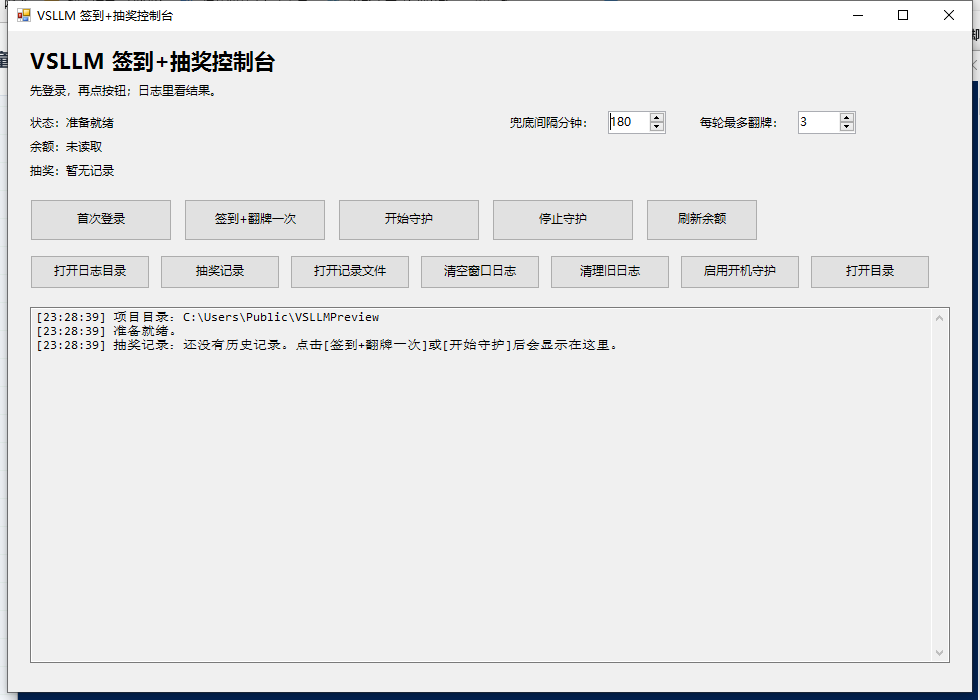

# VSLLM 签到+抽奖控制台

一个面向 Windows 桌面的 VSLLM 自动签到、自动翻牌抽奖和守护工具。



项目针对 `https://vsllm.com/console/personal` 的日常操作做了一个可视化控制台：第一次登录后保存本机登录态，之后可以在后台通过接口执行每日签到、翻牌抽奖、读取余额，并在窗口日志里看到每次执行时间、抽奖结果、累计次数和下一轮预计时间。

> 本项目仅用于个人学习和个人账号自动化管理。使用前请确认你了解并遵守目标网站的服务条款、频率限制和账号规则。

## 功能特点

- 可视化 Windows 控制台，不是静默后台脚本。
- 首次登录使用本机 Chrome/Edge 普通浏览器窗口，不需要手动粘贴 Cookie。
- 登录态保存在本机 `.auth/vsllm-profile`，后续可后台复用。
- 支持每日签到检查，只有确认签到成功或已签到才写入成功记录。
- 支持接口翻牌抽奖，日志显示抽到的奖励、抽奖时间、本轮次数和累计次数。
- 支持守护模式，自动读取网页冷却倒计时，机会刷新后延迟约 10 秒再执行。
- 支持读取账号余额/额度，并显示在控制台顶部。
- 支持右下角托盘常驻，最小化或关闭窗口时不退出。
- 支持开机自动启动守护。
- 支持旧入口文件统一跳转到同一个控制台，避免打开多个后台任务。

## 运行环境

- Windows 10 / Windows 11
- Node.js 18 或更高版本
- npm
- Chrome 或 Microsoft Edge
- PowerShell 5.1 或更高版本

## 安装

克隆项目后进入目录：

```powershell
git clone <你的仓库地址>
cd <项目目录>
```

安装依赖：

```powershell
npm install
```

如果你的环境没有可用浏览器内核，可以安装 Playwright Chromium：

```powershell
npx playwright install chromium
```

## 快速开始

日常只需要打开这个文件：

```text
VSLLM-Launcher.bat
```

第一次使用：

1. 点击 `首次登录`。
2. 在弹出的 Chrome/Edge 窗口里登录 VSLLM。
3. 确认进入个人中心后，关闭浏览器窗口。
4. 回到登录命令窗口按 `Enter`。
5. 回到控制台，点击 `签到+翻牌一次` 或 `开始守护`。

之后使用：

- 想立即执行一次，点击 `签到+翻牌一次`。
- 想自动等待刷新机会，点击 `开始守护`。
- 想停止自动守护，点击 `停止守护`。
- 想只刷新余额，点击 `刷新余额`。

## 控制台按钮说明

| 按钮 | 作用 |
| --- | --- |
| `首次登录` | 打开普通 Chrome/Edge 登录窗口，保存本机登录态。 |
| `签到+翻牌一次` | 执行一次每日签到检查，然后按当前剩余机会翻牌。 |
| `开始守护` | 控制台常驻运行，按页面冷却倒计时自动安排下一轮。 |
| `停止守护` | 停止当前守护任务，并尝试清理旧的后台守护进程。 |
| `刷新余额` | 只读取账户余额/额度，不签到、不翻牌。 |
| `抽奖记录` | 把最近抽奖历史输出到控制台窗口。 |
| `打开记录文件` | 用记事本打开完整抽奖历史。 |
| `清空窗口日志` | 只清空当前窗口内容，不删除历史记录。 |
| `清理旧日志` | 清理旧任务日志，不删除抽奖记录、签到记录和登录态。 |
| `启用开机守护` | 在 Windows 登录后自动打开控制台并开始守护。 |

窗口最小化或点右上角关闭时，会缩到右下角托盘，不会退出程序。双击托盘图标可以恢复窗口。要真正退出，请右键托盘图标选择 `退出程序`。

## 守护逻辑

守护模式启动后会立即执行一轮：

1. 打开 VSLLM 个人中心读取页面状态。
2. 检查每日签到入口。
3. 读取当前翻牌次数，例如 `1/3 次`。
4. 读取冷却倒计时，例如 `1 小时 59 分后可再抽`。
5. 调用分享加成接口。
6. 调用翻牌接口。
7. 写入抽奖结果和下一轮时间。

如果页面能读到冷却倒计时，程序会按网页时间加约 10 秒缓冲安排下一轮。读不到倒计时时，才使用界面里的 `兜底间隔分钟`。

## 抽奖次数说明

控制台里的 `每轮最多翻牌` 默认是 `3`。

这个值不是总次数限制，而是每一轮最多尝试几次。比如设置为 `3`，本轮刷新了 1 次机会就只抽 1 次；本轮刷新了 3 次机会最多抽 3 次。下一轮机会刷新后还会继续抽。

网页里如果显示 `1/3 次`，本项目按“当前还有 1 次可翻，最多 3 次”处理。

## 日志和状态文件

主要运行数据保存在 `logs` 目录：

| 文件 | 内容 |
| --- | --- |
| `logs/draw-history.log` | 抽奖历史，包含时间、奖励和累计次数。 |
| `logs/checkin-history.log` | 签到历史。 |
| `logs/draw-state.json` | 当前状态，包括累计次数、余额、冷却、下一轮时间。 |
| `logs/launcher-ui.log` | 控制台窗口日志。 |
| `logs/task-*.log` | 每次后台任务的详细输出。 |

示例抽奖日志：

```text
[2026/6/21 14:30:31] 抽奖日志：本轮第 1 次 / 累计 10 次：小额惊喜 +1000（common）
```

## 配置

控制台界面可配置：

| 配置 | 默认值 | 说明 |
| --- | --- | --- |
| `兜底间隔分钟` | `180` | 读不到网页倒计时时的备用检查间隔。 |
| `每轮最多翻牌` | `3` | 每轮最多请求几次翻牌，不是总次数限制。 |

也可以通过环境变量配置：

| 环境变量 | 说明 |
| --- | --- |
| `VSLLM_DRAW_LIMIT` | 每轮最多翻牌次数。 |
| `VSLLM_WATCH_INTERVAL_MINUTES` | 守护兜底检查间隔分钟。 |
| `VSLLM_WATCH_BUFFER_SECONDS` | 网页倒计时结束后的额外等待秒数，默认 `10`。 |
| `VSLLM_USER_ID` | 自动识别 `new-api-user` 失败时才需要手动设置。 |
| `VSLLM_BROWSER_EXECUTABLE` | 指定 Chrome/Edge 浏览器路径。 |
| `VSLLM_URL` | 指定 VSLLM 个人中心地址，默认 `https://vsllm.com/console/personal`。 |

## 命令行脚本

也可以不用图形界面，直接运行 npm 脚本：

```powershell
npm run login:browser
npm run api
npm run api:balance
npm run api:watch
```

常用脚本：

| 脚本 | 作用 |
| --- | --- |
| `npm run login:browser` | 打开普通浏览器完成首次登录。 |
| `npm run api` | 执行一次签到+翻牌。 |
| `npm run api:balance` | 只读取余额。 |
| `npm run api:watch` | 命令行守护模式。 |
| `npm run api:headed` | 打开可见浏览器执行 API 流程，方便调试。 |

## 项目结构

```text
.
├─ VSLLM-Launcher.bat          # 推荐入口，打开控制台
├─ launcher.ps1                # Windows Forms 图形控制台
├─ start-launcher.ps1          # 启动器辅助脚本
├─ stop-login-browser.ps1      # 清理登录浏览器辅助脚本
├─ src/
│  ├─ vsllm-api.js             # 后台 API 签到、抽奖、余额、守护逻辑
│  └─ vsllm-auto.js            # 浏览器自动化和首次登录逻辑
├─ logs/                       # 运行日志，本地生成，不建议提交
├─ .auth/                      # 登录态，本地生成，严禁提交
├─ package.json
└─ README.md
```

## 安全提醒

发布到 GitHub 前请确认不要提交这些内容：

- `.auth/`
- `logs/`
- `screenshots/`
- `node_modules/`
- `.env`
- 任何 Cookie、Token、账号密码、请求头截图

本项目已经在 `.gitignore` 中排除了常见敏感目录。尤其不要把 `.auth/vsllm-profile` 上传到公开仓库，因为里面可能包含你的登录态。

## 故障排查

### 提示未登录或登录失效

点击 `首次登录` 重新登录。登录完成后关闭浏览器窗口，再回到登录命令窗口按 `Enter`。

### 提示首次登录窗口还没结束

说明登录浏览器或登录命令窗口还在运行。先关闭浏览器窗口，再回到命令窗口按 `Enter`。如果找不到窗口，可以运行：

```text
VSLLM-清理残留登录.bat
```

### 守护没有马上抽奖

如果页面显示冷却中，程序会等待网页倒计时结束后再抽。控制台日志里会显示下一轮预计时间。

### 顶部余额没有刷新

点击 `刷新余额`。如果仍然未读取，可能是网站接口结构发生变化，或者登录态已经失效。

### 控制台看起来没有更新

运行中的控制台不会热更新脚本。请在右下角托盘右键选择 `退出程序`，再重新打开 `VSLLM-Launcher.bat`。

## GitHub 发布建议

第一次发布可以按这个顺序：

```powershell
git init
git add .
git status
git commit -m "Initial release"
git branch -M main
git remote add origin <你的 GitHub 仓库地址>
git push -u origin main
```

执行 `git add .` 后，建议先运行 `git status` 检查，确认没有出现 `.auth/`、`logs/`、`node_modules/` 这些目录。

## 免责声明

本项目是个人自动化工具示例，不保证目标网站接口长期稳定。网站页面结构、接口参数、登录策略或抽奖规则变化后，脚本可能需要更新。使用者需要自行承担账号、额度、频率限制等相关风险。
